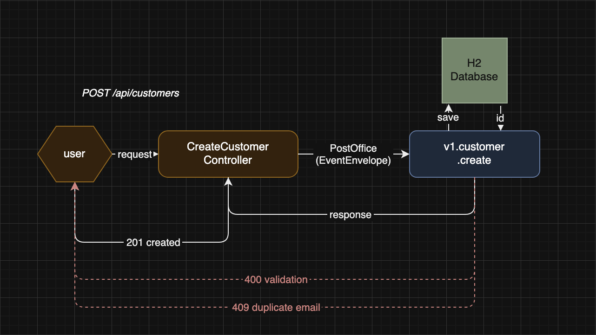
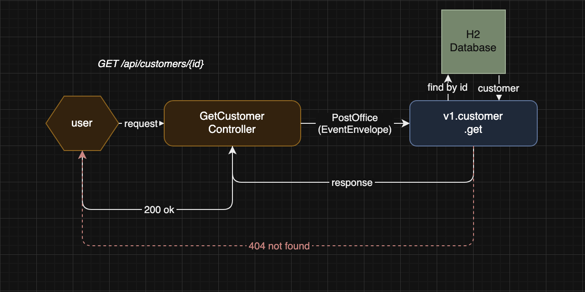

# Customer Service

A RESTful microservice for customer management built with the Mercury Composable framework (rest-spring-3) and Spring Data JPA.

---

## Table of Contents

1. [Overview](#overview)
2. [Technology Stack](#technology-stack)
3. [Getting Started](#getting-started)
4. [Running Tests](#running-tests)
5. [Architecture](#architecture)
6. [API Endpoints](#api-endpoints)
7. [Flow Diagrams](#flow-diagrams)
8. [Project Structure](#project-structure)

---

## Overview

This service provides a simple customer management API with two operations: creating a customer and retrieving a customer by ID. It is built on the **Mercury Composable** architecture using the `rest-spring-3` module, where Spring `@RestController` classes act as the HTTP entry point and delegate all business logic to stateless Mercury functions via the PostOffice event bus.

Unlike the Flow-based approach, there are no YAML pipelines. Each controller sends an `EventEnvelope` to a registered Mercury service and returns the response as a reactive `Mono`.

---

## Technology Stack

| Component | Technology |
|-----------|------------|
| Language | Java 21 |
| Framework | Mercury Composable 4.4.4 |
| HTTP Server | Tomcat (via Spring Boot) |
| Spring Boot | 3.5.12 |
| Persistence | Spring Data JPA + Hibernate |
| Database | H2 (in-memory) |
| Build Tool | Gradle 9 |
| Testing | JUnit 5 — end-to-end integration tests |

---

## Getting Started

**Prerequisites:** Java 21, Gradle (wrapper included).

**Build Mercury locally** (required — Mercury 4.4.4 is not published to Maven Central):

```bash
cd /path/to/mercury-composable
mvn install -DskipTests
```

**Run the application:**

```bash
./gradlew bootRun
```

The REST API is available at `http://localhost:8100`.  
The H2 web console is available at `http://localhost:8100/h2-console`.

H2 console connection settings:
```
JDBC URL:  jdbc:h2:mem:customerdb
Username:  sa
Password:  (leave blank)
```

**Example requests:**

```bash
# Create a customer
curl -X POST http://localhost:8100/api/customers \
  -H "Content-Type: application/json" \
  -d '{"name": "Alice", "email": "alice@example.com"}'

# Get a customer
curl http://localhost:8100/api/customers/1
```

---

## Running Tests

```bash
./gradlew test
```

Tests are written as end-to-end integration tests following the Mercury Composable testing pattern. The test suite starts the full application (including Spring Boot, Spring context, and H2 database) via `AutoStart.main()` and sends real HTTP requests through Mercury's built-in `async.http.request` client.

This approach validates the complete request path: HTTP routing, controller logic, Mercury event dispatch, service logic, database interaction, and error handling — all in a single test run.

The test application starts on port 8101 and uses a separate in-memory H2 database (`testdb`) to avoid conflicts with a running instance of the application.

---

## Architecture

This service follows the **Mercury rest-spring-3** pattern. Spring `@RestController` classes handle incoming HTTP requests and dispatch them to stateless Mercury functions via the `PostOffice` event bus using `EventEnvelope`. The Mercury functions perform the business logic and interact with the database.

```
HTTP Request
    |
    v
@RestController        -- Spring MVC controller receives the HTTP request
    |
    v
PostOffice             -- sends an EventEnvelope to the target Mercury service
    |
    v
TypedLambdaFunction    -- stateless Mercury service registered via @PreLoad
    |
    v
CustomerRepository     -- Spring Data JPA → H2 Database
```

Each Mercury service is registered under a versioned route name (e.g. `v1.customer.create`) and runs on a kernel thread pool via `@KernelThreadRunner` to ensure compatibility with Hibernate's thread-local transaction management.

The controller receives the response as a `CompletableFuture` and wraps it in a `Mono` for reactive HTTP response. Errors thrown as `AppException` inside the service are propagated back through the `EventEnvelope` and re-thrown by the controller, which causes Mercury to return the appropriate HTTP status code.

**Single server port is used:**

| Port | Server | Purpose |
|------|--------|---------|
| 8100 | Tomcat (Spring Boot) | REST API + H2 web console at `/h2-console` |

---

## API Endpoints

### Create a Customer

```
POST /api/customers
Content-Type: application/json
```

Request body:
```json
{
  "name": "Alice",
  "email": "alice@example.com"
}
```

Responses:

| Status | Description |
|--------|-------------|
| 201 | Customer created successfully |
| 400 | Validation failed (blank name, invalid email format, name too long) |
| 409 | A customer with the given email already exists |

Success response body:
```json
{
  "id": 1,
  "name": "Alice",
  "email": "alice@example.com"
}
```

---

### Get a Customer

```
GET /api/customers/{id}
```

Responses:

| Status | Description |
|--------|-------------|
| 200 | Customer found |
| 400 | ID is missing or not a number |
| 404 | Customer with the given ID does not exist |

Success response body:
```json
{
  "id": 1,
  "name": "Alice",
  "email": "alice@example.com"
}
```

Error response body (400 / 404 / 409):
```json
{
  "status": 404,
  "message": "Customer not found"
}
```

---

## Flow Diagrams

### Figure 1 — Create a Customer (`POST /api/customers`)



The request enters through `CreateCustomerController`, which builds an `EventEnvelope` and sends it to the `v1.customer.create` service via `PostOffice`.

The service performs the following steps:

1. **Validation** — checks that `name` and `email` are not blank, that `name` does not exceed 100 characters, and that `email` matches a valid format. Throws `AppException(400)` on failure.

2. **Duplicate check** — queries the database to verify that no customer with the same email already exists. Throws `AppException(409)` on a duplicate.

3. **Persistence** — saves the new customer to the H2 database via Spring Data JPA and retrieves the auto-generated ID.

4. **Response** — returns a map with `id`, `name`, and `email` back through the `EventEnvelope`. The controller wraps it in `ResponseEntity` with HTTP status 201.

Any `AppException` thrown inside the service is returned as an error `EventEnvelope`. The controller detects it via `response.hasError()` and re-throws it, causing Mercury to respond with the appropriate HTTP status code.

---

### Figure 2 — Get a Customer (`GET /api/customers/{id}`)



The request enters through `GetCustomerController`, which extracts the `{id}` path variable, sets it as a header on the `EventEnvelope`, and sends it to the `v1.customer.get` service via `PostOffice`.

The service performs the following steps:

1. **ID parsing** — reads the `id` header and parses it as a `Long`. Throws `AppException(400)` if the value is missing or not a number.

2. **Lookup** — queries the H2 database via Spring Data JPA. If the customer is found, it is returned as a map with `id`, `name`, and `email`. If not found, throws `AppException(404)`.

The controller receives the result and returns it as `ResponseEntity` with HTTP status 200.

---

## Project Structure

```
src/
├── main/
│   ├── java/com/deviceshop/customer/
│   │   ├── MainApp.java                         -- application entry point
│   │   ├── config/
│   │   │   └── JpaConfig.java                   -- enables JPA repository scanning
│   │   ├── models/
│   │   │   └── Customer.java                    -- JPA entity
│   │   ├── rest/
│   │   │   ├── CreateCustomerController.java    -- POST /api/customers
│   │   │   └── GetCustomerController.java       -- GET /api/customers/{id}
│   │   ├── services/
│   │   │   ├── CreateCustomerService.java       -- v1.customer.create
│   │   │   └── GetCustomerService.java          -- v1.customer.get
│   │   └── storage/
│   │       └── CustomerRepository.java          -- Spring Data JPA repository
│   └── resources/
│       └── application.properties
└── test/
    ├── java/com/deviceshop/customer/
    │   ├── support/
    │   │   └── TestBase.java                    -- starts the full application once
    │   └── CustomerTest.java                    -- end-to-end integration tests
    └── resources/
        └── application.properties               -- test configuration (port 8101, H2 testdb)
```